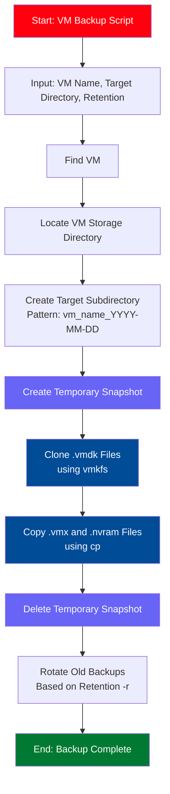

# vmESXIBackup

Script for creating manual backups of VMs on VMWare ESXi hosts. Usefull for unlicensed versions of ESXi, as they are unable to be backed up by conventional methods/solutions.

This script relies on `vim-cmd` and `vmkfs` on the ESXi hosts to work. The backup mechanism is utilizing snapshots, so the backup can be performed while the VM is running.

> [!CAUTION]
> Currently supports only VMs, which are stored on a single volume (meaning all files defining the VM (.vmx and all .vmdk/s) must be stored on the same volume)

## Flow of the script

The script finds the VM based on its supplied name, resolves it to a VMID and finds the directory where the VM is stored. A a subdirectory is created in the specified target directory by the pattern `<vm_name>_$(date -I)`, ie: `debian_2025-11-25`. Then a temporary snapshot is created, all required .vmdk files are cloned using `vmkfs`, and .vmx and .nvram files are copied using generic `cp`. At the end, the temporary snapshot is deleted and old snapshots are rotated according to the provided `retention number (-r)`.



## Script usage

Move the script to the ESXi host and make it executable:

```bash
chmod +x vmESXIBackup.sh
```

Launch the script with two mandatory parameters - name of the VM, and the target directory where the backups should go to.

- `-n <name of the VM>`
- `-b <directory where the backup should be stored>`

Two optional parameters are also available - the retention number and the debug switch:

- `-r <number of backups to keep>`
- `-d` (see section xxx)

### Example

```bash
sh vmESXIBackup.sh -n debian -b /vmfs/volumes/backups/
```

## Debug

Before launcing the script on a production VM, it might be advisable to first test the script by running it in debug mode `-d`. This mode adds many "breakpoints" to the code, and waits for the user to confirm if the result so far are correct, before continuing on to the next sections in the code.

Working principle of the debug mode can be seen below.

```bash
[root@localhost:/opt] sh vmESXIBackup.sh -n debian-bkp -b /vmfs/volumes/datastore1/backups/ -d
Retention number not specified, using default
Debug mode enabled
########## Tue Nov 25 11:33:42 UTC 2025 ##########
CREATE DIRECTORY. Press enter to continue
Tue Nov 25 11:33:45 UTC 2025 - VM Name "debian-bkp" was resolved to VM ID: 15
----- CREATE TEMPORARY SNAPSHOT -----
CREATE TMP SNAPSHOT. Press enter to continue
...
```
